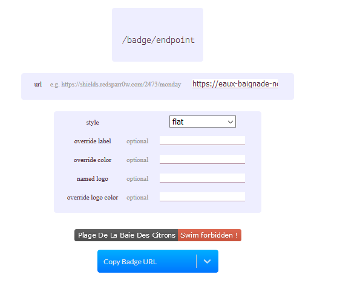

[](https://travis-ci.org/adriens/eaux-baignade-noumea)


# eaux-baignade-noumea

API pour accéder à la qualité des eaux de baignade, via le crawling de www.noumea.nc (http://www.noumea.nc/actualites/qualite-des-eaux-de-baignade-0)

# Badges

Pour avoir le badge au format svg du status de la plage :

```
/plages/{plageId}/badge.svg
```

# Shield Endpoint

[Shield endpoint](https://shields.io/endpoint) a été implémenté pour une expérience optimale :

```
https://eaux-baignade-noumea.herokuapp.com/plages/{plageId}/shield
```




En html :

```html
<a href="https://www.noumea.nc/actualites/qualite-des-eaux-de-baignade-0">
  
</a>
```

# Endpoints

```
/plages
/plages/{plageId}
/plages/{plageId}/badge.svg
/drapeaux
/drapeaux/{drapeauId}
/metadatas
https://eaux-baignade-noumea.herokuapp.com/plages/{plageId}/shield
```

Sur Heroku :

```
https://eaux-baignade-noumea.herokuapp.com/plages
https://eaux-baignade-noumea.herokuapp.com/plages/{plageId}
https://eaux-baignade-noumea.herokuapp.com/plages/badge.svg
https://eaux-baignade-noumea.herokuapp.com/drapeaux
https://eaux-baignade-noumea.herokuapp.com/drapeaux/{drapeauId}
https://eaux-baignade-noumea.herokuapp.com/metadatas
https://eaux-baignade-noumea.herokuapp.com/plages/{plageId}/shield
```

# Docker

A terme, je vais automatiser le buid, démarrer, jusqu'à la release
de l'image sur les repos.

Créer l'image :

```
docker build -f DockerFile -t eaux-baignades
```

Lister les images :

```
docker images
```

Démarrer l'image :

```
docker run -p 8080:8080 eaux-baignades
```

[Installer jq](https://stedolan.github.io/jq/download/) puis :

Ouvrir terminal et tester un endpoint ( [jq](https://stedolan.github.io/jq/)
pour afficher proprement):

```
curl http://localhost:8080/plages | jq '.' | less
```

# Documentation swagger

Bien que minimaliste et très perfectible, la doc swagger : https://eaux-baignade-noumea.herokuapp.com/swagger-ui.html
